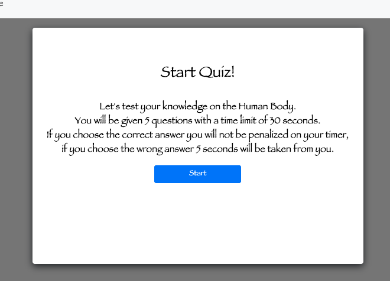

# Code Quiz

As a coding bootcamp student, I want to take a timed quiz on Javascript fundamentals that stores high scores so that I can gauge my progress compared to my peers

* Play proceeds as follows:

  * The user arrives at the landing page and is presented with a call-to-action to "Start Quiz." Also note the navigation option to "View Highscores" and the "Time" value set at 0.

  * Clicking the "Start Quiz" button presents the user with a series of questions. The timer is initialized with a value and immediately begins countdown.

  * Score is calculated by time remaining. Answering quickly and correctly results in a higher score. Answering incorrectly results in a time penalty.

  * When time runs out and/or all questions are answered, the user is presented with their final score and asked to enter their initials. Their final score and initials are then stored in `localStorage`.

## Please check out my work: 

https://kimiinglet.github.io/Quiz_time/

https://github.com/kimiinglet/Quiz_time.git

